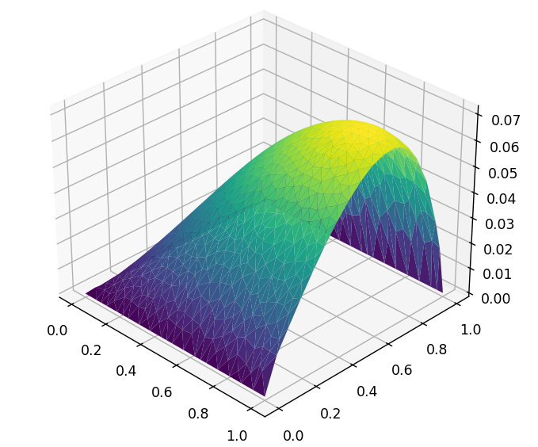

# AmiFEM

  

Very simple educational example of FEM lib implementation similar to FEniCS.

## Purpose

Library is created to show to students how FEM can be implemented in more abstract and general way.

## Supports

1. definition of finite elements of any order by adjoint basis on triangle
2. abstract form language for defining linear problems
3. limited to 2D scalar problems
4. any geometry
5. **triangle** lib is used for triangulations
6. implemented plotter is limited to output of vertex values only

## Implementation details

Library is fully functional, but it is computationally not efficient, since it uses pure Python handling of abstract form expressions with nested lambda functions.
Mentioned part is the heaviest part in the lib execution. Actually for each computation of a form in some point we need to traverse under the hood
defined expression. Since it is composed of nested function calls even elementary operations such as addition are handled as a separate function call.
While such way is very simple and good for educational purposes to show how we can make FEM implementation more general and abstract, for
real production usage we definitely need to extend this library with more efficient expression handling, which should be made in such way, that
expression will be computed directly as a sequence of native machine instructions. This can be achieved by making additional node-based structures for assembling expressions
from abstract language definition and by traversing these expressions to generate low-level assembler instructions or for example C-based expressions
with further JIT compilation and execution in scope of process (which is exactly the same way as FEniCS uses).

## Notes

Library is created for educational purposes and can contain bugs.

**Written without code generation by AI tools.**

*Copyright (c) 2026 Roman Drebotiy*

*Licensed under the Apache License 2.0 (see LICENSE file)*